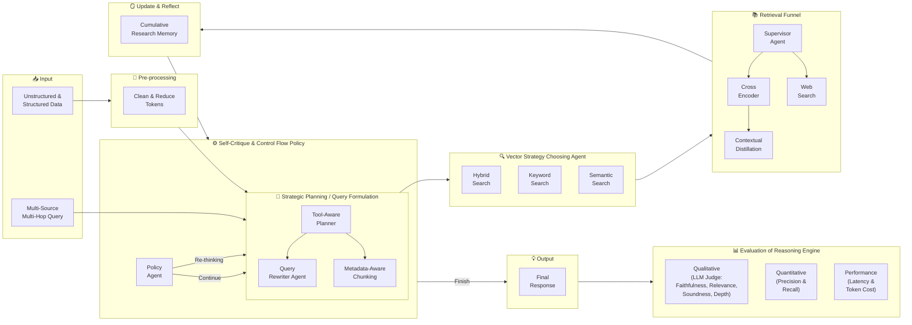

# Agentic Deep-Thinking RAG Pipeline — Mermaid Block Diagram

> This file contains the **Mermaid renderable block diagram** for the deep-thinking pipeline.
> For architecture descriptions, executor details, and One-Shot vs Deep-Thinking comparison, see [`README.md`](README.md) and [`RAG.Comparison.md`](RAG.Comparison.md).

## Block Diagram



## Phase-by-Phase Diagram

```
┌─────────────────────────────────────────────────────────────────────────────────────┐
│                     DEEP-THINKING AGENTIC RAG — 6-PHASE LOOP                        │
│                     "How a good researcher actually works"                          │
│                                                                                     │
│                            User Query                                               │
│                                │                                                    │
│                                ▼                                                    │
│   ┌─────────────────────────────────────────────────────────────────────────────┐   │
│   │  Phase 1 — PLAN                                                             │   │
│   │  "Figure out what to find before you start looking"                         │   │
│   │                                                                             │   │
│   │  Planner breaks the question into N sub-questions.                          │   │
│   │  Each gets a tool:   search_docs  (internal)   or   search_web  (live)      │   │
│   └────────────────────────────┬────────────────────────────────────────────────┘   │
│                                │ StepSignal(0)                                      │
│   ┌────────────────────────────▼────────────────────────────────────────────────┐   │
│   │  ↻  RESEARCH LOOP  ──────────────────────────────────────────────────────┐  │   │
│   │  │                                                                        │  │  │
│   │  │  Phase 2 — RETRIEVE   "Cast a wide net"                                │  │  │
│   │  │                                                                        │  │  │
│   │  │     ┌──────────────────────────┐   ┌──────────────────────────┐        │  │  │
│   │  │     │      search_docs         │   │       search_web         │        │  │  │
│   │  │     │  Vector / Keyword /      │   │  Tavily · live results   │        │  │  │
│   │  │     │  Hybrid  ·  Top 10       │   │  Top 5 web pages         │        │  │  │
│   │  │     └────────────┬─────────────┘   └─────────────┬────────────┘        │  │  │
│   │  │                  └──────────────┬─────────────────┘                    │  │  │
│   │  │                          Top 10 candidates                             │  │  │
│   │  │                                 │                                      │  │  │
│   │  │  Phase 3 — REFINE   "Right words in · only signal out"                 │  │  │
│   │  │                                                                        │  │  │
│   │  │     Query Rewriter  ─────────►  sharpen query before search            │  │  │
│   │  │     Distiller  ──────────────►  top 3 chunks → 1 dense paragraph       │  │  │
│   │  │                                                                        │  │  │
│   │  │  Phase 4 — REFLECT   "Write it in the notebook"                        │  │  │
│   │  │                                                                        │  │  │
│   │  │     Reflection Agent  ───────►  1 factual sentence                     │  │  │
│   │  │     RagState.ResearchHistory  ►  [ step 0,  step 1,  step 2 … ]        │  │  │
│   │  │                                                                        │  │  │
│   │  │  Phase 5 — CRITIQUE   "Do I know enough yet?"                          │  │  │
│   │  │                                                                        │  │  │
│   │  │     Policy Agent reads full RagState                                   │  │  │
│   │  │                                                                        │  │  │
│   │  │          CONTINUE                              FINISH                  │  │  │
│   │  │    (next sub-question)                   (evidence complete)           │  │  │
│   │  │          │                                      │                      │  │  │
│   │  └──────────┘                                      │                      ┘  │  │
│   │  ▲──────── loops back to Phase 2 with next step ───┘                         │  │
│   └──────────────────────────────────────────────────────────────────────────────┘  │
│                                          │ FINISH                                   │
│                                          ▼                                          │
│   ┌──────────────────────────────────────────────────────────────────────────────┐  │
│   │  Phase 6 — SYNTHESIZE   "Sit down and write the final answer"                │  │
│   │                                                                              │  │
│   │  Synthesis Agent reads full RagState  (all steps · all evidence)             │  │
│   │  Writes cited, multi-source, comprehensive answer                            │  │
│   └────────────────────────────────┬─────────────────────────────────────────────┘  │
│                                    │                                                │
│                              Final Answer ✓                                         │
│                                                                                     │
└─────────────────────────────────────────────────────────────────────────────────────┘
```

---
